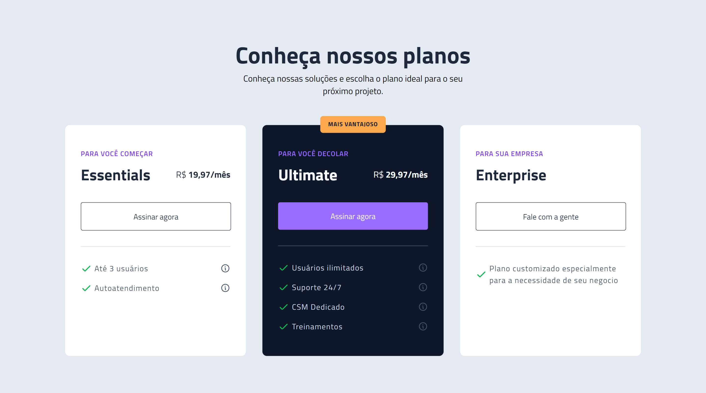

<h1 align="center"> Pricing Table - BoraCodar#15 </h1>

[Clique aqui para acessar](https://maik-emanoel.github.io/pricing-table-2/)

## 🚀 Tecnologias

Esse projeto foi desenvolvido com as seguintes tecnologias:

- HTML
- CSS
- Git and GitHub

## 💻 Projeto

Este é um projeto da interface de uma Tabela de preços. 

Obs: Projeto construído a partir do layout proposto no desafio [#BoraCodar14](https://boracodar.dev/) realizado pela [Rocketseat](https://rocketseat.com.br).
Após o desenvolvimento do projeto inicial, adicionei novas features, tais quais:

- Layout responsivo (Adaptado para telas menores)
- Adição de efeitos hover
- Adição de animação na entrada dos cards
- Pequena modificação no layout

## 🔖 Layout

Você pode visualizar o layout do projeto proposto através [DESSE LINK](https://www.figma.com/community/file/1227809985897425342/). É necessário ter conta no [Figma](https://figma.com) para acessá-lo.